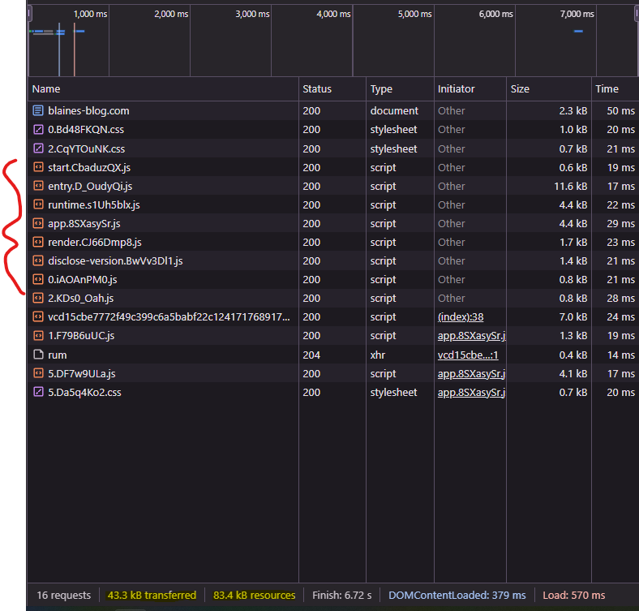
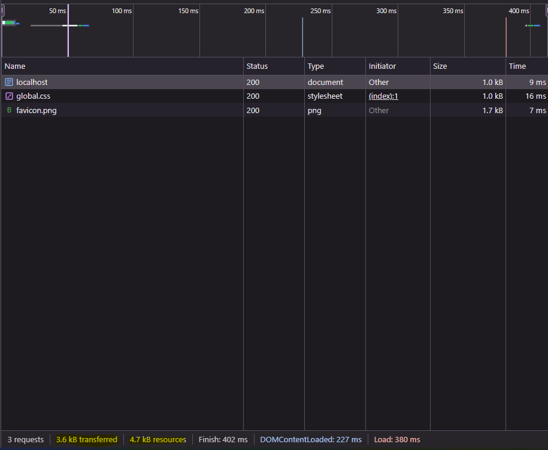

# Moving this blog from Svelte to Astro

It's been a few months since I made my post decrying poorly performing websites. It always bugged me to
have that article live lamenting overly complex pages while I made my own simple as hell blog an SPA.
It was built with Svelte(pre-runes), which to be fair is a pretty performant option for an SPA, but it's
still overkill. I wanted to practice what I preach and build my dead simple website with dead simple
tech. Enter [Astro](https://astro.build/).

Astro is a framework(because everything is a framework I guess) that feels like water in the desert. 
In the intro blog post, authors Fred Schott and Nate Moore write: "There’s a simple secret to building a 
faster website — just ship less". As a result of this philosophy, Astro ships 0 JavaScript to the client 
by default. All pages are instead rendered to static HTML. For the JavaScript you do need, it's rightly
treated as an add-on, allowing specific components to be hydrated on demand. Oh, and for those components
you can use *any* JavaScript framework. Well, almost any. Astro provides official integrations
for Alpine, Preact, React, Solid, Svelte, and Vue. They also host an [integrations directory](https://astro.build/integrations/)
which has just about everything else you could want(but no Ember support, sorry Ember devs).

I'm just building a simple blog though, so I shouldn't be reaching for any gnarly components just yet. What 
I really need is a static-site generator. Luckily, Astro is a pleasant option for that case. It has 
oh-so-sweet JSX-like expressions:

```astro
<Layout>
    <ul>
        {
            sortedPosts.map((post: any) => (
                <li>
                    <a href={`/${post.id}`} class="pageLink">
                        {post.data.title}
                    </a>
                    <p>{post.data.publishDate}</p>
                </li>
            ))
        }
    </ul>
</Layout>
```

It also has built-in Markdown support, which let me finally refactor these posts into pure Markdown
files for easy writing. I was using raw HTML/CSS to write my posts before, and yes it was
painful<sup id="fnr-1">[1](#fn-1)</sup>. This re-write was also a good excuse to finally clean up
my css, moving all of the common blog styles into a single component. Svelte wasn't stopping me from
doing this, but Astro made it such a painless process. Now all my blog styles live in a single CSS
file which I import once into the BlogPostLayout component:

```astro
---
import Layout from "../layouts/Layout.astro";
import "../styles/blog-post.css";
---

<Layout>
    <div id="articleContainer">
        <article>
            <slot />
        </article>
    </div>
</Layout>
```

Images are another thing you get for free. Astro's native [Image](https://docs.astro.build/en/guides/images/)
component will prerender images into a number of different sizes, then serve the appropriate size according
to the dimensions of the img tag to be populated. It also converts images into a modern format if needed. For 
instance, my images are stored as ".png" in my project, but Astro converts them to ".webp" during the build.

But really, I'm re-writing this blog for one reason: getting rid of all the JavaScript. It may seem tame compared
to the horrors of the modern [e-commerce site](https://blaines-blog.com/post-2), but check out all of the script
sent by the Svelte version:  Those
files marked with red are all Svelte specific. They're not that huge, which is why the blog feels so fast even with
them all there, but that's not the point. They don't need to be there at all! This blog is bare bones at the moment.
There's no dynamic behavior I need that isn't already handled by the browser. And yes, that's because I'm not doing
anything more than displaying some static text, links, and images, but you don't need much more than that to
make a lot of sites. Certainly client-side JavaScript has no reason to be on this one. Clients shouldn't have to
wait for KB's of JavaScript to download, parse, and execute to setup a facsimile of the actual browser. Especially
not when the browser is doing just fine on it's own. So, what does the network trace look like for the astro version?
 I think I'm in love.

The question that lingers in my mind now is: do you even need anything other than Astro to build for the web? Well,
if you're building something incredibly app-y, like Gmail, Figma, or freaking [Photoshop](https://medium.com/@addyosmani/photoshop-is-now-on-the-web-38d70954365a), then ya, maybe you should reach for an SPA framework. But most people and 
companies don't have websites like that. There's usually plenty of static content and simple user forms/interactions.
According to Akamai's RUM Archive most SPA's get [one](https://rumarchive.com/insights/#spa-aspect) soft navigation
for every hard navigation. So the main selling point of SPA's(avoiding the costly loading of new urls) appears to be
an illusion. Fast first time loading is paramount given this reality. The best way to accomplish that is to send less,
and I can't think of a better mindset to achieve that than accepting JavaScript as a mere add-on. With Astro those add-ons
can even use the big frameworks in moderation if you must. Are there pain points developing this way that will prove too
tough to beat? I'm not sure, but I can't help but believing this is the future. At least, the future I hope for. But it
is finally the present for this blog.


<div class="footnote" id="fn-1">
    Funny, this is what HTML/CSS were specifically made for. Why's it so painful?<sup><a href="#fnr-1">[return]</a></sup>
</div>
