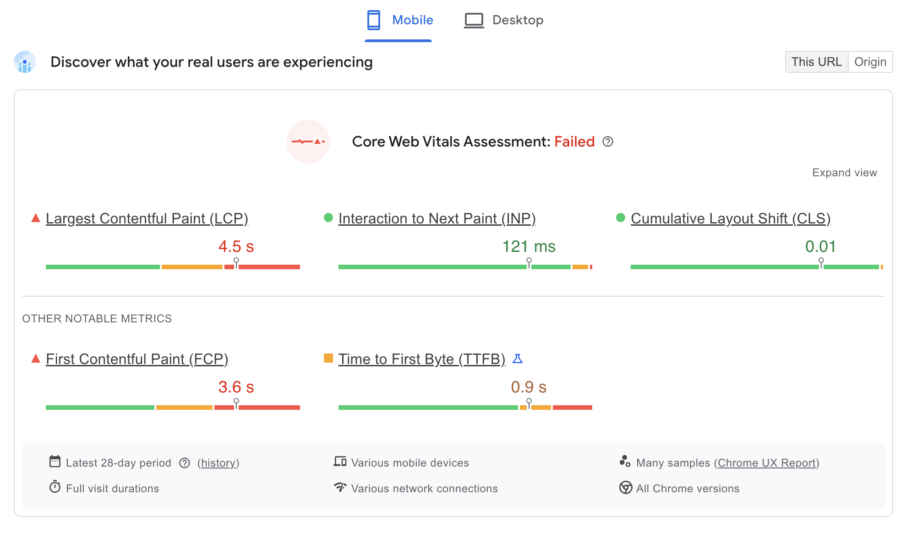
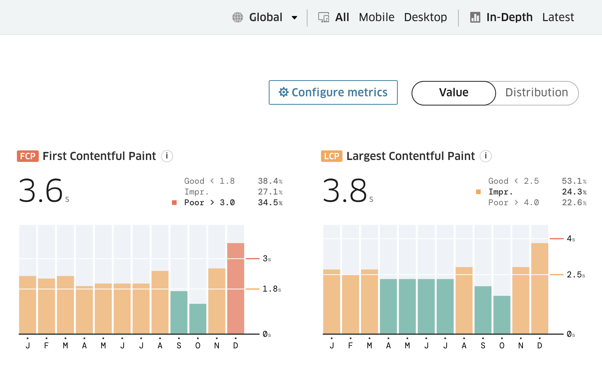
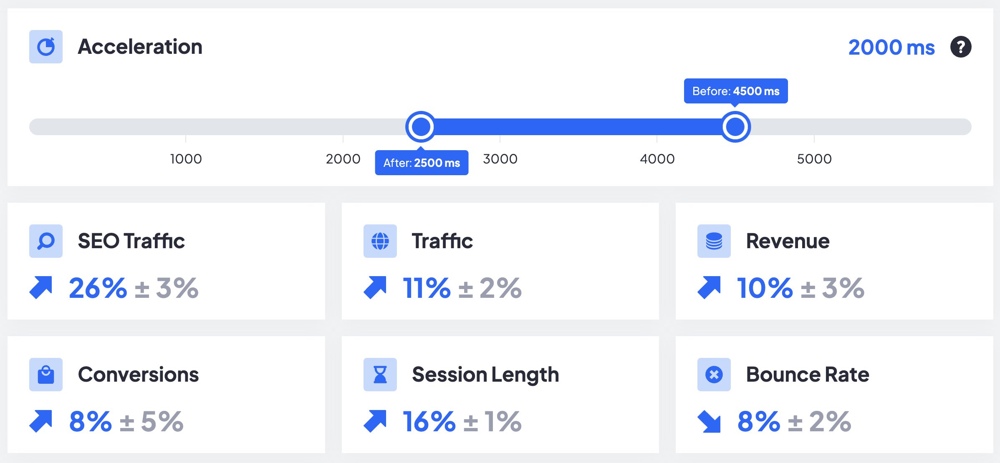
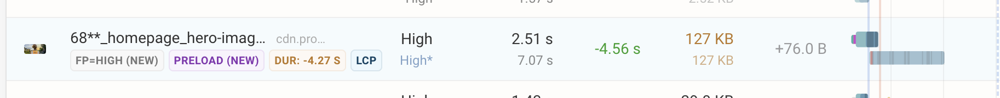
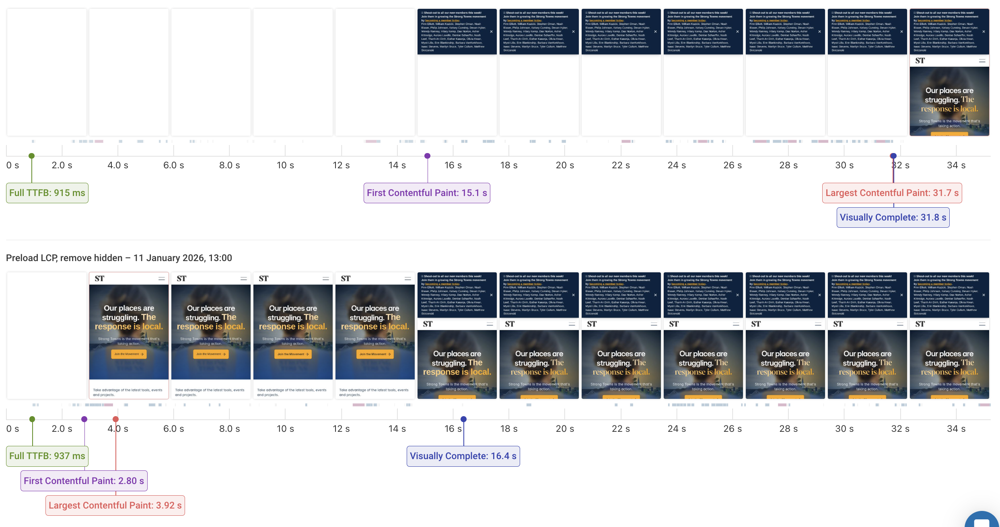

# Strong Towns Web Peformance Audit

If you've ever noticed my about page on this blog, you may have seen that I call out my interest
in "sustainable infrastructure". That interest is almost entirely thanks to [Strong Towns](https://www.strongtowns.org/). 
Especially the books and talks by its founder, Chuck Marohn. Reading the book "Strong Towns" caused
such a sea change in how I view and think about everything that it legitmately changed my life. It 
also left me with a nagging fascination with urbanism as a bonus. If you're even a little interested
in how human societies live, grow, and thrive then give it a shot. Then, fall down the rabbit hole
of infrastructure dysfunction in the US, like I did. It's a fun time!

Lately, I noticed the Strong Towns website felt a little slow to load, so I decided look into some
of their RUM metrics. I pulled up PageSpeed Insights and sure enough, they were failing their
[Core Web Vitals Assessment](https://pagespeed.web.dev/analysis/https-strongtowns-org/769d9uhmjp?form_factor=mobile). 
INP and CLS looked great still, but LCP was sluggish, falling into the "poor" category for mobile
users and just barely out of "poor" in the "needs improvement" section for desktop users. For context, 
LCP is a measure of how long it took for the website to load the main content on the page. It's highly
correlated with perceived load speed, so it's a good indication of how fast it *feels* like your
site is loading on arrival. You could argue that LCP is the most important CWV metric. After all, if users 
are frustrated by slow loading they might not even make it to the site at all. Treo shows that there has 
been a [recent regression](https://treo.sh/sitespeed/www.strongtowns.org) in FCP/LCP, but on mobile those 
two have been in "needs improvement" for most of the last year. What's going wrong here? 

## Why should Strong Towns care?

Before we get into the problems, it's reasonable to ask "Why should Strong Towns care about LCP?" There
are two things to broadly consider here: User Experience and SEO. If User Experience is poor, those who
make it to your website(or try to) will be less likely to spend time there, and even less likely to spend
money there. Google also uses page speed metrics as a ranking factor, so fewer users will be sent to
your website in the first place. SpeedHub, a free tool created by Google, Speed Kit, and the University 
Of Hamburg, allows us to estimate the the effect of "Page Speed" increases on key business metrics by aggregating the results of real-world case studies. For simplicity, let's plug in the current mobile LCP time from PageSpeed
Insights as "before", and the minimum time to achieve a "good" LCP as "after"(2.5 seconds)[1](#footnote1): 

We can see that with a quicker load time, users are likely to stay longer and spend more. This probably
aligns with your personal experience. I certainly get frustrated at slow websites, espcecially on mobile,
and I'm less likely to put up with them if there's a good alternative. Google also notices and sends much 
more traffic your way, a staggering estimated 26% increase. With that, let's look at what's slowing down 
this page and what can be done about it.

## Offscreen YouTube player

Looking at the resources the page loads, there's a lot of what you would expect. Many images, some CSS
files, and a large amount of scripts. These resources are fairly normal for a large modern webpage, and
the vast majority of them have no effect on LCP. Many of the scripts are for tracking/analytics and are
rightly loaded asynchronously, meaning that they are loaded and exectuted without stopping the critical
rendering path of the initial page load. Of the render-blocking resources, one thing stands out: the 
code for the youtube player further down the page. The HTML needed is 55 KB large, the CSS is 59 KB, and
the 2 JS files are 475 and 450 KB. This is just the compressed size too. The size of each file that the
browser ultimately parses and evaluates is much larger. This isn't to say that the whole player should
be removed from the page, just that it should get out of the way of the initial page load. 

The easiest way to accomplish this is by [lazy-loading](https://web.dev/articles/iframe-lazy-loading) it. 
Simply put `loading="lazy"` on the the iframe tag containing the player and it will only load once the user 
starts to scroll towards it. The caveat here is that this won't work for users on the slowest connections. 
Chrome compensates for slow connections by increasing the ["distance from viewport"](https://web.dev/articles/browser-level-image-lazy-loading#distance-from-viewport)
needed to defer loading of the tag. This makes sense, as slower connections will have difficulty reacting
in time to a user scrolling down the page. The YouTube video isn't that far down the page, so it's considered
part of the essential content immediately near the viewport. The easy solution to this is to move the
video further down, but this may be undesirable as it requires some re-design on the page and will likely
lead to less views.

To alleviate this problem for all users we should try to load fewer resources. There are a number of
libraries which have been written to make embedding a YouTube video a much more lightweight task. For
instance, [Lite YouTube Embed](https://github.com/paulirish/lite-youtube-embed) claims to render "224x
faster" than the normal embedded player. This library even lets you asynchronously load the JS it needs,
progessively enhancing the player once the script loads. I would still recommend lazy-loading this
element to get it out of the critical rendering path, but for slow users it would now be a much lighter
load.

## LCP image lazy-loaded

The thing that Google looks at to determine Largest Contentful Paint and ultimately what users notice most
when a page loads is the "LCP candidate". This usually refers to the largest element visible on the initial
screen, often the Hero image in the background. This is also the case for Strong Towns. The good news is
that this image is already being served in a modern format, avif, which stores images in much less space than traditional PNG/JPG images. The bad news is that this image is being lazy-loaded. It's within the viewport,
so the browser eventually realizes its importance and starts to load it, but it takes extra time. Ideally,
the LCP image would be loaded ASAP, since we know that we will always need it to render the page. We can
do this by placing a `<link rel="preload">` in the `<head>` of the document. This forces the browser to start
loading the LCP image right away. We can also make sure that the browser tries to fetch it first(or nearly
first) by putting the `fetchpriority="high"` attribute on our preload link. Testing this simple change using
[DebugBear](https://www.debugbear.com/?noredirect), I was able to load the LCP image 4.5 seconds faster on a 
slow connection/device. 

## Page is hidden with CSS while loading

When it comes to LCP, perhaps the biggest problem this page has is one CSS statement. Most of the content on 
the page, including the LCP image, is hidden using the `visibility: hidden` property. This hides the vast majority
of the page while everything loads. I can only speculate why this was added, but perhaps it was to prevent
users from seeing ugly "flashes of unstyled content"(FOUC) while things like fonts, images, and scripts are
loaded. This can even be helpful for a Core Web Vital: Cumulative Layout Shift(CLS), a measure of unexpected
shifts in the layout of a page. Only showing the page content once everything has loaded can prevent the page
from moving elements around haphazardly while different resources load. For instance, a large image might take
a while to download, then pop in suddenly and move all elements below it down the page slightly. Hiding content
to avoid this problem is certainly one solution to the problem, but usually it's better to handle this in other
ways. The browser doesn't work like this by default for good reason. It's better for users to see a page being
constructed, getting feedback that the page is actually working, versus seeing only a blank screen for a
prolonged period of time. This filmstrip of my DebugBear test shows how different this can look for users with
a slow connection: 
The top strip is using the live site code; the bottom strip removes the CSS hiding
and preloads the LCP image. The user experiences 15 seconds of blank screen, where it's not obvious whether or
not the site works at all. Then, they get a small popup before having to wait another 17 seconds for the site
to display anything else. This test also shows that the impact on LCP is drastic, improving from 31.7 seconds to 
3.92 seconds. I suspect that the difference is so stark because the hidden property takes much longer to remove
than necessary. It's probably waiting for many non-critical resources to load, like scripts for ads and analytics.
The page in this test made 97 requests, but only a small fraction of those are needed before we can display
something to the user. The rest of those resources can load in the background while the user engages with the
content. If we actually do have a large number of resources that need to load before the LCP, then we should
try to identify those and preload them right away in the document head.

## Moving Forward

This analysis is a only a few of the possible optimizations for the page, and I only looked at the home page.
Similar optimizations probably exist for other pages on the site. It's especially important to make sure that
revenue-generating pages are heavily optimized, like the membership page. Often times the fixes, such as the
ones detailed here, can be fairly quick to implement thanks to the tireless work of the web performance
community. There's a lot of low-hanging fruit out there to be picked, someone just needs to know to go pick it.
If nothing else I hope that Strong Towns will be able to get its LCP brought back down, as I want more people
learning about the movement, reading their articles, and ultimately spreading the word!

    1. Note that the studies used to provide this estimate looked a variety of page speed metrics, not just LCP.
    It's possible to have a good LCP, but still poor "page speed" if the page is visually complete yet unresponsive
    for a long period.
    <a href="#footnote-ref-1">[return]</a>

