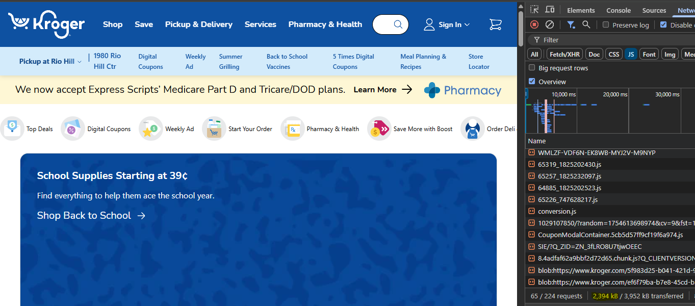

# Why is Web Performance Undervalued?

Web performance is one of those things so fundamental to businesses that you would expect them to absolutely nail it.
If consumers care about performance, which seems [to be true](https://wpostats.com/), then in an efficient, competitive
market you would expect businesses to be under immense pressure to optimize it. And yet, poor web performance is
[ubiquitous](https://infrequently.org/2024/10/platforms-are-competitions/#fn-failure-on-repeat-2). Huge companies across
the board are shipping websites and web apps so sluggish that it is [killing the web](https://infrequently.org/2024/10/platforms-are-competitions/). The economic upside of getting it right isn't tiny either.
Years ago while working at Kroger, Taylor Hunt calculated that each KB of JavaScript sent to the client was costing the
company [\$100,000 per year](https://dev.to/tigt/making-the-worlds-fastest-website-and-other-mistakes-56na#fnref), **as
a lower bound**. How much is Kroger sending today? 
Oh, Just 2.4 **Megabytes**. Out of a chonky 4 MB payload. Assuming they could rebuild the site to hit Alex Russell's
target of [450 KB](https://infrequently.org/2021/03/the-performance-inequality-gap), that's conservatively $195,000,000
per year. [Not too bad](https://www.youtube.com/watch?v=UKpMhn07cxA&ab_channel=PetarPetrovic). And this is likely a
**profound underestimation** of the real gain. As Taylor mentions in a [podcast](https://youtu.be/Vcq2DvkMz3k?t=7269),
dramatic gains in performance wouldn't just lead to predictable linear gains in revenue. They would inspire unpredictably
large changes in user behavior as users realized the newfound feasability and convenience. Why on earth would any company
leave that on the table?
